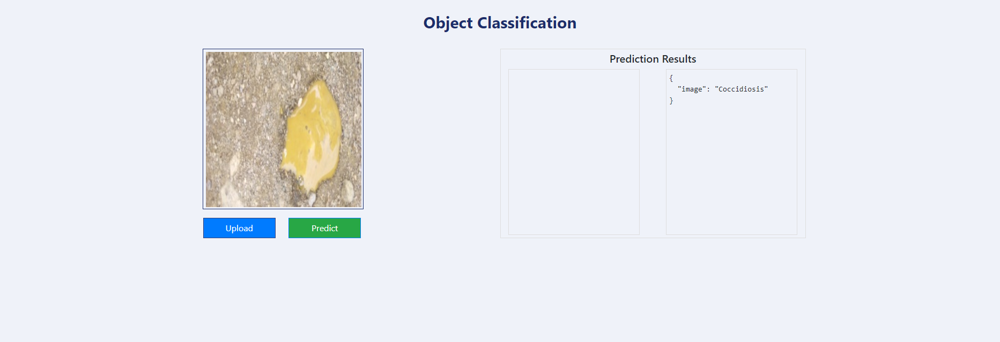
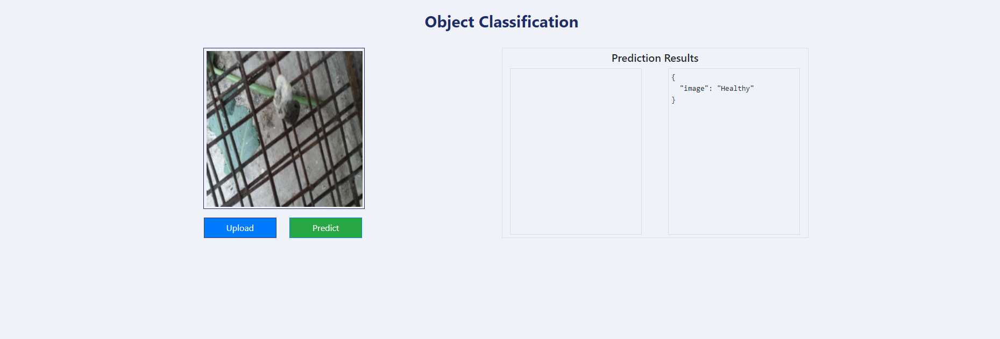
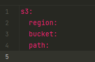

# Chicken-Disease-Classification
 
## Problem Statement

To detect diseases in chickens at an early stage using deep learning techniques,
preventing mortality in chickens, farmers loss due to mortality among chickens and ultimately keeping us healthy too.
The aim of this project is
to develop a very intelligent system for the early identification of various diseases in chickens.
VGG16 from Keras Applications was implemented for the categorical classification of "Coccidiosis" and "Healthy." 

## Demo 

<div>
    
    
</div>

You can find the deployed link to the project here: https://chickenapp1.azurewebsites.net 

(I have terminated this for now due to the high computing cost incurred in running this application.)

## Workflows

It is critical to follow this workflow to avoid confusion when working with each component.
1. Update config.yaml
2. Update secrets.yaml
   
   

3. Update params.yaml
4. Update the entity
5. Update the configuration manager in src config
6. Update the components
7. Update the pipeline
8. Update the main.py
9. Update the dvc.yaml

## How to run this in local

Before you run the project, make sure that you are configuring your AWS S3 Bucket called as **chicken-fecal-images**,
that contains a zip file named **chicken-fecal-images.zip**
that in turn has a folder named chicken-fecal-images which has two folders, namely **coccidiosis** and **healthy**.
Now within each of these aforementioned folders contains the fecal images of coccidiosis infected chicken and a healthy chicken respectively.

### STEPS:

Clone the repository

```bash
git clone https://github.com/tejangupta/Chicken-Disease-Classification.git
```
### STEP 01- Create a conda environment after opening the repository

```bash
conda create -n chicken python=3.8 -y
```

```bash
conda activate chicken
```

### STEP 02- install the requirements

```bash
pip install -r requirements.txt
```

### STEP 03- Export the environment variables (Linux)

```bash
export PYTHONPATH=$PYTHONPATH:/path/to/Chicken-Disease-Classification
export AWS_ACCESS_KEY_ID=<AWS_ACCESS_KEY_ID>
export AWS_SECRET_ACCESS_KEY=<AWS_SECRET_ACCESS_KEY>
```
### STEP 04- Run the application server

```bash
python app.py
```

### STEP 05- Train application

```bash
http://localhost:80/train
```

### STEP 06- Prediction application

```bash
http://localhost:80/predict
```

## Azure CI/CD deployment with GitHub Actions 

Save the password generated under Access keys in your container registry somewhere safe.
You can only see the password after enabling Admin user in Access keys.

### Run from terminal one by one:

```bash
docker build -t <login_server>/<your_project_name>:<tag> .
docker login <login_server>
docker push <login_server>/<your_project_name>:<tag>
```

### Deployment Steps:

1. Build the Docker image of the Source Code
2. Push the Docker image to Container Registry
3. Launch the Web App Server in Azure 
4. Pull the Docker image from the container registry to Web App server and run
